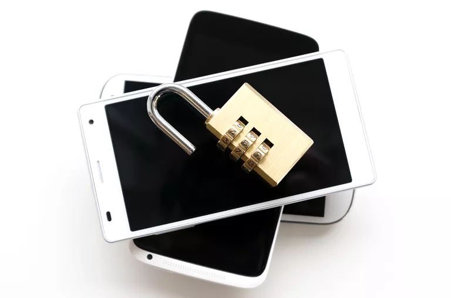

How to unlock your Xiaomi phone
===============================

Any smartphone has a bootloader—a program that launches an operating system when the smartphone is powered on. A bootloader of a Xiaomi phone is by default locked, which means that only a pre-installed operating system can be launched.

You can unlock the bootloader of your phone to be able to install any other operating system, for instance LineageOS. The unlocking procedure is legal and easy.

.. toctree::
   
   apply
   download
   launch
   unlock
